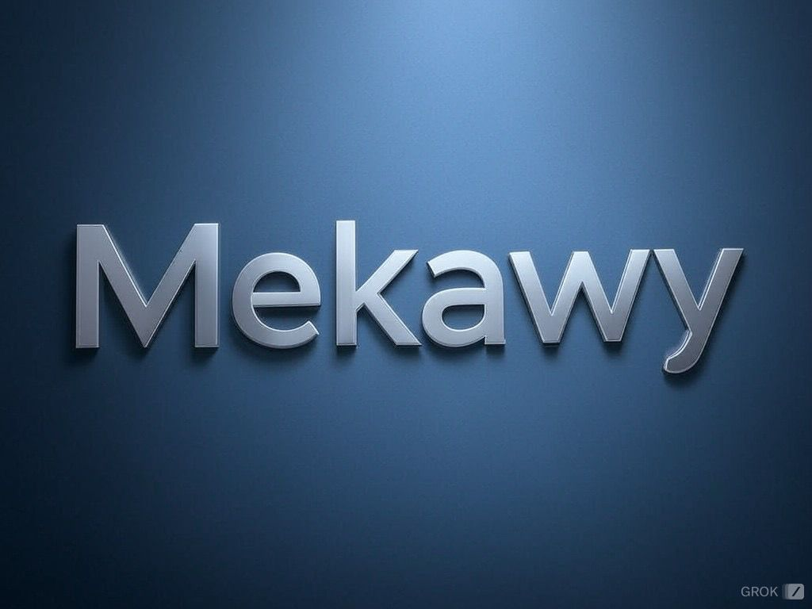

# Mekawy YT Downloads



A **powerful, lightweight, and user-friendly YouTube video downloader** built with Flask and `yt_dlp`. Mekawy Downloads is designed to make downloading videos as simple as possible with an intuitive, mobile-first web interface and a seamless user experience.

---

## Features

✅ **Automatic Resolution Selection**: Downloads the best available resolution for the video.  
✅ **Mobile-First Design**: Fully responsive interface, styled with Tailwind CSS, for optimal performance on mobile devices.  
✅ **Progress Tracking**: Real-time spinner updates to indicate download progress.  
✅ **Simple Setup**: No complex configurations—just run and download!  
✅ **Automatic Saving**: Videos are saved in the `downloaders` folder without requiring manual input.  

---

## Demo

### Web Interface:


### Progress Spinner:


---

## Requirements

- Python 3.7 or newer
- Internet connection
- Required libraries: `Flask`, `yt_dlp`

---

## Installation

Follow these steps to set up Mekawy Downloads on your system:

### 1. Clone the Repository
```bash
git clone https://github.com/hosenmekawy/mekawy-downloads.git
cd mekawy-downloads
```

### 2. Install Dependencies
Install the required Python libraries:
```bash
pip install flask yt-dlp
```

### 3. Run the Application
Start the Flask development server:
```bash
python app.py
```

### 4. Access the Application
Open your web browser and navigate to:
```
http://127.0.0.1:5000
```

---

## How to Use

### Step 1: Enter the Video URL
Paste the YouTube video URL into the input field.


### Step 2: Start the Download
Click the **Download** button to start downloading.

### Step 3: Monitor Progress
A spinner will indicate the progress of the download. Once complete, you’ll be notified.

---

## Output Location

All downloaded videos are automatically saved in the `downloaders` folder located in the same directory as the script. The videos are saved with their original titles and extensions.

---

## Example

Here’s a step-by-step example:

1. Open the app:
   

2. Paste a YouTube link:
   

3. Watch the spinner progress:
   

4. Check your `downloaders` folder:
   

---

## Advanced Usage

### Running on a Custom Port
By default, the app runs on port `5000`. To run it on a custom port, modify the `app.run()` line in the script:
```python
app.run(host="0.0.0.0", port=8080)
```

---

## Troubleshooting

### Common Issues
- **Video not downloading:** Ensure the video URL is valid and the video is publicly accessible.
- **Permission errors:** Make sure the `downloaders` folder is writable.
- **Slow downloads:** Check your internet connection or try a different video.

---

## Contribution

Contributions are welcome! Feel free to fork the repository and submit a pull request. If you encounter any issues, please open an issue on GitHub.

---

## License

This project is licensed under the MIT License.

---

## Author

Made with ❤️ by [Hussien Mekawy](https://github.com/hosenmekawy)  

- **GitHub:** [github.com/hosenmekawy](https://github.com/hosenmekawy)  
- **LinkedIn:** [linkedin.com/in/hussien-mekawy-5b11161a7](https://www.linkedin.com/in/hussien-mekawy-5b11161a7)

--- 

Now you can paste this directly into your `README.md` file. Let me know if you need any further edits!
